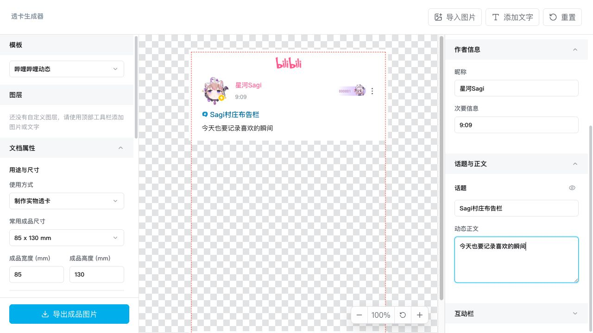

# Clear Card Designer

透卡生成器。项目目标是通过本地网页编辑透卡内容、图片图层、尺寸和导出参数，并生成带透明区域的 PNG。



## 快速使用

1. 从 [GitHub Releases](https://github.com/Loong-T/clear-card-designer/releases) 下载最新的
   `clear-card-designer-*-offline.zip`。
2. 解压 ZIP，双击其中的 `index.html`。
3. 选择哔哩哔哩动态模板或空白画布，并设置成品尺寸。
4. 编辑模板内容，或通过顶部工具栏添加图片和文字图层。
5. 调整图层位置、大小、旋转、透明度和层级。
6. 点击左侧的“导出成品图片”下载透明 PNG。

整个编辑和导出过程均在浏览器本地完成，不会上传图片或编辑内容。无需安装 Node.js、
启动本地服务器或连接网络。

建议使用最新版桌面 Chrome 或 Edge。读取本机字体需要浏览器支持并由用户授权；不可用时，
编辑器会继续使用当前字体和系统字体降级，不影响其他功能。

## 功能

- B 站动态风格竖版模板
- 多图片图层上传、拖拽、缩放、旋转、镜像、层级调整
- 动态正文、互动数据、模块显示编辑
- 实物尺寸模式：常见 mm 尺寸、DPI、出血参考线
- 纯图片模式：常见竖版比例和自定义像素尺寸
- 通过 `dom-to-image-more` 导出透明 PNG

## 开发与构建

开发环境需要：

- Node.js 22
- pnpm 10.30.2

安装依赖并启动开发服务器：

```bash
pnpm install
pnpm dev
```

常用检查与构建命令：

```bash
pnpm check
pnpm test
pnpm build
```

`pnpm check` 会依次执行格式检查、Lint 和生产构建。`pnpm build` 会生成并校验可直接分发的
`dist/index.html`。

生产构建会将运行所需的 JavaScript、CSS、图片和 SVG 全部内联到单文件 HTML。构建结束后
会自动确认 `dist/` 仅包含 `index.html`，且产物中不存在外部资源引用。

## CI 与发布

推送到 `main` 分支或创建目标为 `main` 的 Pull Request 时，GitHub Actions 会自动运行
`pnpm check` 和 `pnpm test`。

正式发布时，先将 `package.json` 中的版本号更新为目标版本，再推送同版本的
`vX.Y.Z` 标签。Release 工作流会构建并验证单文件网页，生成仅包含 `index.html` 的离线
ZIP 包及 SHA-256 校验文件，并自动发布到 GitHub Releases。

## 素材版权

- `src/assets/bilibili-dynamic/` 下的 Logo、图标、装饰及图片素材，其版权及相关权利归哔哩哔哩所有，不包含在本项目的 MIT 许可证授权范围内。本项目与哔哩哔哩无隶属、授权或官方合作关系，相关素材仅用于实现模板展示效果。
- `src/assets/icons/github.svg` 归 [Simple Icons](https://simpleicons.org/) 所有，使用 CC0 许可证。

## 项目结构

```text
src/app/                 应用入口、状态编排和全局样式
src/assets/              内置本地素材
src/components/card/     卡片预览和导出目标
src/components/editor/   编辑器面板与图层控件
src/templates/           模板默认内容和尺寸预设
src/types/               跨模块共享类型
src/utils/               导出、图片加载、图层创建和尺寸计算
scripts/                 构建校验脚本
```
